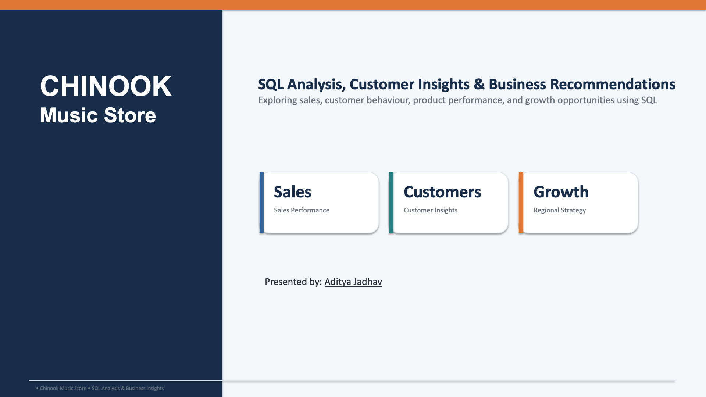
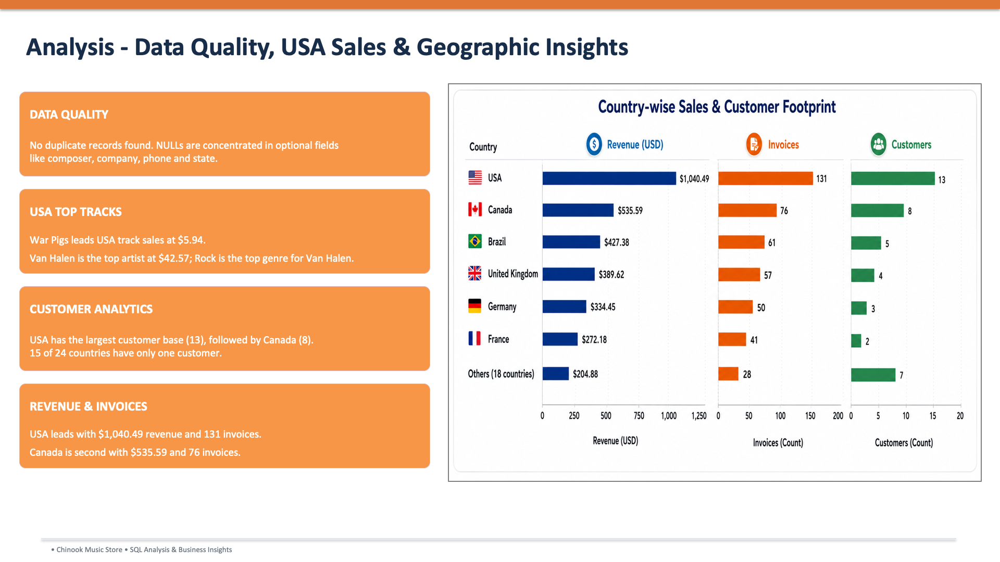
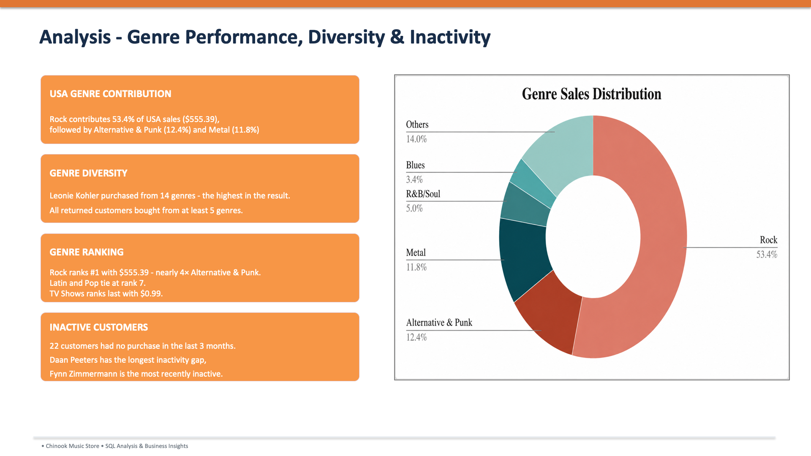
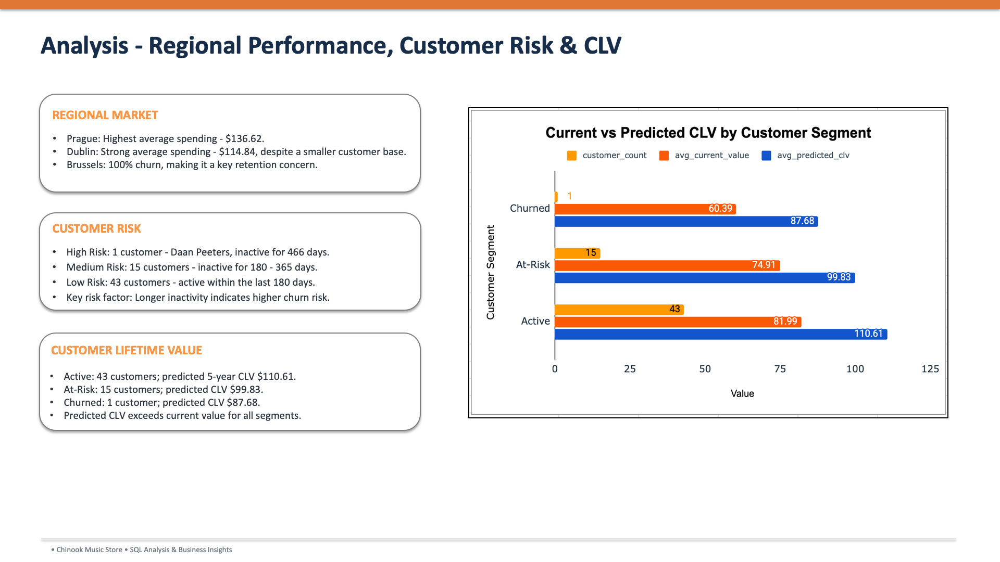
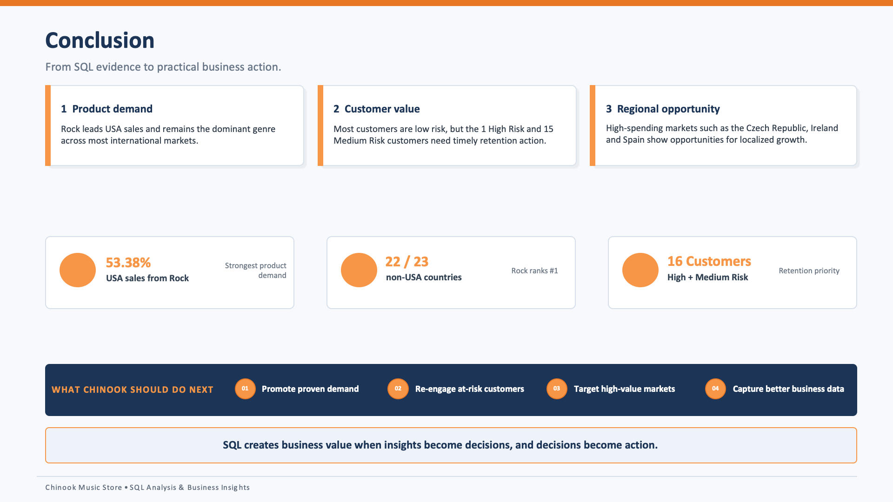

# Chinook Music Store – SQL Data Analysis

## About the Project

I worked on the Chinook Music Store database to explore its sales, customers, music products, and purchasing patterns using SQL.

The main goal was to understand the data, answer business-related questions, and identify insights that could help with sales, customer retention, and regional business decisions.

## Tools Used

- MySQL
- SQL
- MySQL Workbench

## What I Worked On

During this project, I explored the database and worked on the following areas:

- **Data Quality:** Checked tables for NULL values and duplicate records.
- **Sales Analysis:** Analysed revenue across tracks, artists, genres, and countries.
- **Customer Analysis:** Examined customer spending, purchase frequency, and average order value.
- **Customer Retention:** Analysed customer inactivity and grouped customers based on risk levels.
- **Product Analysis:** Explored popular music genres, artists, albums, and customer preferences.
- **Geographic Analysis:** Compared customer spending and music preferences across different regions.

## Some Key Findings

A few interesting findings from the analysis:

- Rock was the leading genre in 22 out of 23 non-USA countries.
- Van Halen generated the highest artist revenue, at **$42.57**.
- "War Pigs" was the highest-revenue track in the USA, generating **$5.94**.
- The USA generated **$1,040.49** in revenue across 131 invoices.
- Frantisek Wichterlova was the highest-spending customer, with total purchases of **$144.54**.
- The customer risk analysis identified 1 high-risk, 15 medium-risk, and 43 low-risk customers.
- Prague recorded average spending of **$136.62**, with 30 purchases.

## Business Recommendations

Based on the findings, I identified some areas the business could focus on:

- Promote popular genres, artists, and albums to support sales.
- Pay attention to customers with longer periods of inactivity and consider targeted retention campaigns.
- Explore regional marketing opportunities based on differences in music preferences.
- Maintain better campaign records to measure the results of marketing activities.
- Track customer purchasing behaviour regularly to identify changes over time.

## Project Files

| File | Description |
|---|---|
| [SQL Analysis](Chinook_SQL_Data_Analysis.sql) | SQL queries used throughout the project |
| [Detailed Report](Chinook_SQL_Data_Analysis_Report.docx) | Complete analysis, findings, and explanations |
| [Presentation](Chinook_SQL_Data_Analysis_Presentation.pptx) | Summary of the analysis and business recommendations |

## Limitations

- Campaign data was not available, so campaign effectiveness could not be measured directly.
- The invoice data covers the period from 2017 to 2020.
- Some fields contained NULL values, including 978 missing composer values.
- Customer risk categories and predicted customer lifetime value (CLV) are estimates based on the available data.

## Conclusion

This project gave me practical experience working with a relational database and using SQL to investigate business questions. It also helped me understand how to connect query results with business insights and recommendations.

## Project Screenshots

### Project Overview

### Data Quality, Sales & Geographic Insights

### Genre Performance & Customer Insights

### Customer Risk & Lifetime Value

### Project Conclusion

